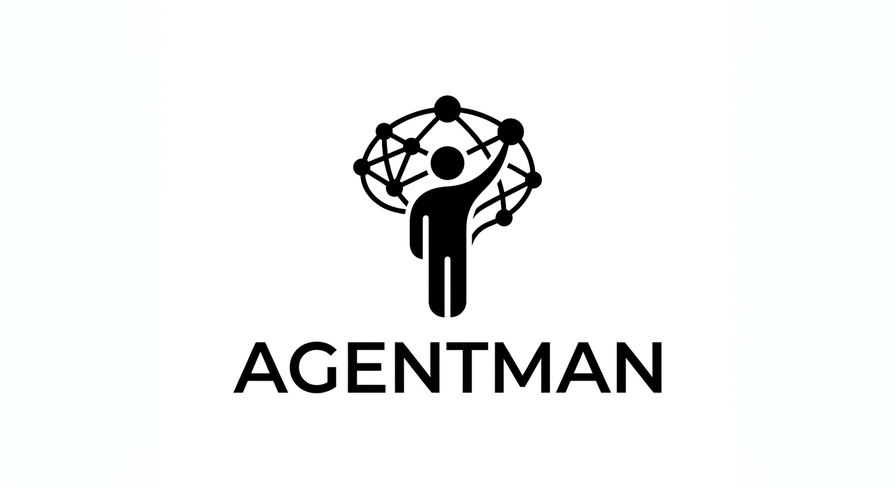

# Agentman



Colourful, local-first TUI session management for the coding agents you use every day.

## Install

```bash
cargo install agentman
agentman
```

Or install the platform-selecting npm wrapper (macOS ARM64, Windows x64,
Linux x64, and Linux ARM64):

```bash
npm i -g agentman-cli
agentman
```

Agentman reads local metadata from the agent directories below and never needs a network connection during normal use:

| Agent | Storage | Native launch support |
| --- | --- | --- |
| Codex | `~/.codex` | resume, fork, YOLO |
| Claude Code | `~/.claude` | resume, YOLO |
| OpenClaude | `~/.openclaude` | resume, fork, YOLO |
| Pi | `~/.pi` | resume, fork |
| Codewhale | `~/.codewhale` | resume, fork |
| DSH | `~/.dsh` | resume where available |
| ACRYL | `~/.acryl` | resume where available |

The exact installed command is used when available. Unknown or opaque records stay visible as read-only diagnostics; Agentman will not rewrite conversation content to guess a title.

## Shortcuts

`↑`/`↓` or mouse wheel navigate · `Enter` resume · `f` fork · `y`/`Y` YOLO resume/fork · `r` rename · `d` move to Trash · `/` search · `?` help · `q` quit.

Rename edits recognized native metadata atomically. Delete always moves the selected file or directory to the macOS Trash after an explicit confirmation, so Finder can recover it.

YOLO modes intentionally bypass agent safety prompts. Review the generated command and only use them in a workspace you trust.

## Development

```bash
cargo fmt --check
cargo clippy -- -D warnings
cargo test
cargo run
```

Check or install updates with `agentman update`; inspect the installed version with `agentman --version`.

MIT licensed.
